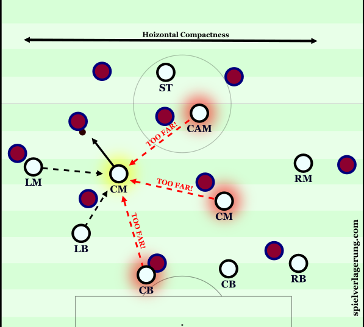
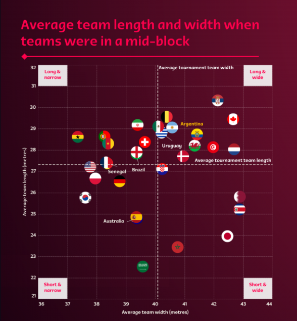

# Researching Methods

## Related Papers

---

### Defensive line height and team length

**Concept:** Defensive line height highlights the distance between a team’s goal line and its deepest outfield player. It shows how deep a team defends while out of possession, and how high it pushes its defensive unit while in possession.

**Summary:** [This FIFA breakdown](https://www.fifatrainingcentre.com/en/fwc2022/efi-metrics/efi-metric--defensive-line-height-and-team-length.php#) by Arsene Wenger describes how the **defensive line** has a dual role; to show how low a team defends when out of possession and how high it pushes when it is attacking.

**Defensive Line Height** is the distance between the goal-line and the deepest outfield player.
**Team Length** is the average vertical distance between the highest and deepest outfield players.

**Suggested Work:**

- To implement a defensive line height feature
- To implement a team length feature
- Implement toggleable visualization for both features within animation
- To separate formation into attacking, midfield and defensive unit, tracking the deepest player in each unit and engineering features related to the difference in line height of different units.
- Annotate when team is in/out of possession and study this metric in and out of possession separately
- Doing econometric analysis with

---

### Tactical Theory: Compactness

**Concept:** Defining and Measuring Compactness

**Summary:** [This article](https://spielverlagerung.com/2015/05/08/tactical-theory-compactness/) describes measures of compactness, and how to evaluate an optimal level of compactness.

- Defensive Connections
  - One of the advantages of high compactness is the increased number of connections between individual defenders.
  - A connection could be classified as when a player is within distance to be able to support a teammate, such as through a secondary press.
  - This means a defensive block can be much more stable against penetrative actions (dribbles or passes). Passing lanes are tighter.

- Ball near compaction creates defensive overloads and controls key areas of the pitch. Without good ball access areas with underloads in a compact formation can be exploited.
- Spatial control through overload in key areas.
- Controlling half spaces and central areas is key in compactness since wing play leads to inefficient attacking when the numerical superiority in the middle is also with the defensive team making them less vulnerable to crosses.
- The less compact a team is, the larger areas individual players have to cover within their domain leading to more fatigue.
- Reduced counterpressing threat, since a lost ball can quickly be pressured/recovered by nearby players.

**Suggested Work:**

- The paper correctly suggests using compactness as a measure of control of the pitch in defensive areas. Utilise [this paper](https://www.frontiersin.org/articles/10.3389/fspor.2021.676179/full) to engineer a feature regarding team compactness/control in defensive formation.
- Somehow getting ball data to fully unlock the meaning of compactness in any analysis.
- Studying relation between team compactness and match fatigue
- Doing econometric analyses with goals cnonceded/scored and average compactness.

---

### Controlling the game without the ball: The mid-block and compactness

**Concept:** During the knockout stages of FIFA World Cup Qatar 2022 the Technical Study Group observed and noted how teams that progressed to the latter stages of the tournament were demonstrating an ability and willingness to control the game without the ball for longer periods.

**Summary:** [This FIFA article](https://www.fifatrainingcentre.com/en/fwc2022/technical-and-tactical-analysis/controlling-the-game-without-the-ball--the-mid-block-and-compactness.php#:~:text=The%20compactness%20of%20a%20team,to%20play%20between%20their%20lines.) defines phases of game which can be tagged as a midblock
Definition of a midblock:

- Team has been stationary for at least 1.6 seconds during the previous 2.0 seconds
  - Stationary: players moving at less than 10km/h
- Team has to form horizontal lines (except highest outfield player)
- At least four defending players organised behind the ball and not meeting the criteria of a "Low-Block".

**Suggested Work:**

- Implement a classification model for the following out of possession phases:
  - High Press
  - Mid Press
  - Low Press
  - High-Block
  - Mid-Block
  - Low-Block
  - Recovery
  - Defensive Transition
  - Counter Press.
- Make a compactness visualization for the season similar to: 

---

### Developing a tactical metric to estimate the defensive area of soccer teams: The defensive play area

**Concept:** By studying the corelation between half outcomes and team-shape, evaluate a metric for defensive area coverage.

**Summary:** [This article](https://journals.sagepub.com/doi/10.1177/1754337115583198?icid=int.sj-abstract.similar-articles.3#core-collateral-purchase-access) proposes a computational method to inspect the tactical position of players during the match and a new metric to analyse the defensive pressure made by a soccer team:

- This metric is calculated at 1Hz
- Is purely based on cartesian coordinates of players;

Which is exactly what we have!

**Suggested Work:**

- Implement the described features.
